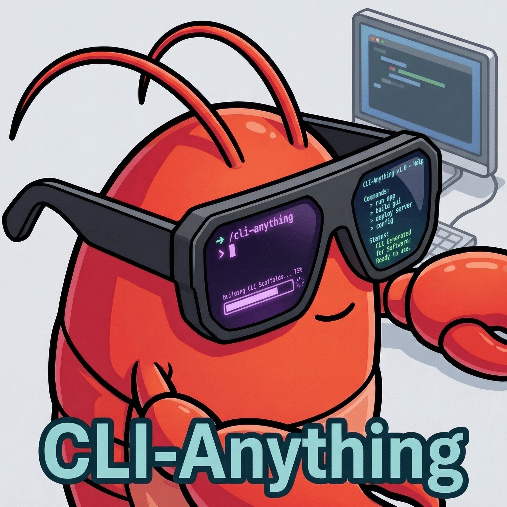

<h1 align="center">&nbsp; tarunAI Connect: Making ALL Software Agent-Native</h1>

<div align="center">
  <strong>Today's Software Serves Humans👨‍💻. Tomorrow's Users will be Agents🤖.<br>
  tarunAI Connect: Bridging the Gap Between AI Agents and the World's Software</strong>
</div>

<div align="center">
  
[](https://github.com/tharunramagiri/tarunai-connect)
[](LICENSE)
[](https://python.org)
[](https://tarunai.ramagiritharun.in)
[](https://github.com/tharunramagiri/tarunai-connect/pulls)

</div>

---

**tarunAI Connect** is a CLI framework that auto-generates stateful CLI interfaces for GUI applications, making them agent-native. Forked from CLI-Anything and rebranded for the tarunAI ecosystem.

With 40+ ready-to-use harnesses for applications like GIMP, Blender, Inkscape, LibreOffice, Audacity, OBS Studio, and more, tarunAI Connect lets AI agents directly control desktop software.

## Quick Start

```bash
# Install the package manager
pip install tarunai-connect

# Browse available CLI harnesses
tarunai-connect list

# Install a harness
tarunai-connect install gimp

# Use it
cli-anything-gimp --help
```

## What's Inside

- **`cli-hub/`** — Python package manager for browsing, installing, and managing 40+ CLI harnesses
- **40+ Harnesses** — agent-native CLI wrappers for popular GUI applications
- **Plugin system** — extend with custom integrations

## Documentation

```bash
tarunai-connect --help         # Package manager help
tarunai-connect list           # Browse all CLIs
tarunai-connect search <term>  # Search CLIs
tarunai-connect info <name>    # CLI details
tarunai-connect install <name> # Install a CLI
tarunai-connect launch <name>  # Launch an installed CLI
```

## For AI Agents

tarunAI Connect is designed to be agent-friendly:

```bash
pip install tarunai-connect
tarunai-connect list --json    # Machine-readable listing
tarunai-connect install gimp
cli-anything-gimp --json project list
```

## License

Apache License 2.0

## Links

- **Repository**: [github.com/tharunramagiri/tarunai-connect](https://github.com/tharunramagiri/tarunai-connect)
- **Web**: [tarunai.dev](https://tarunai.dev)
